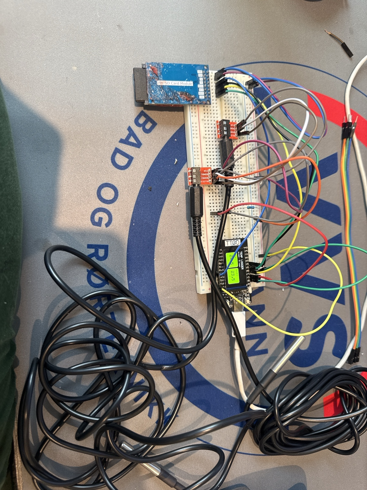
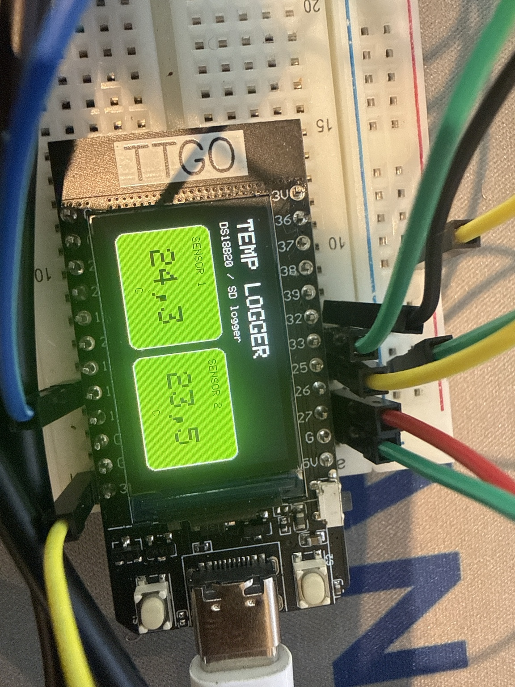
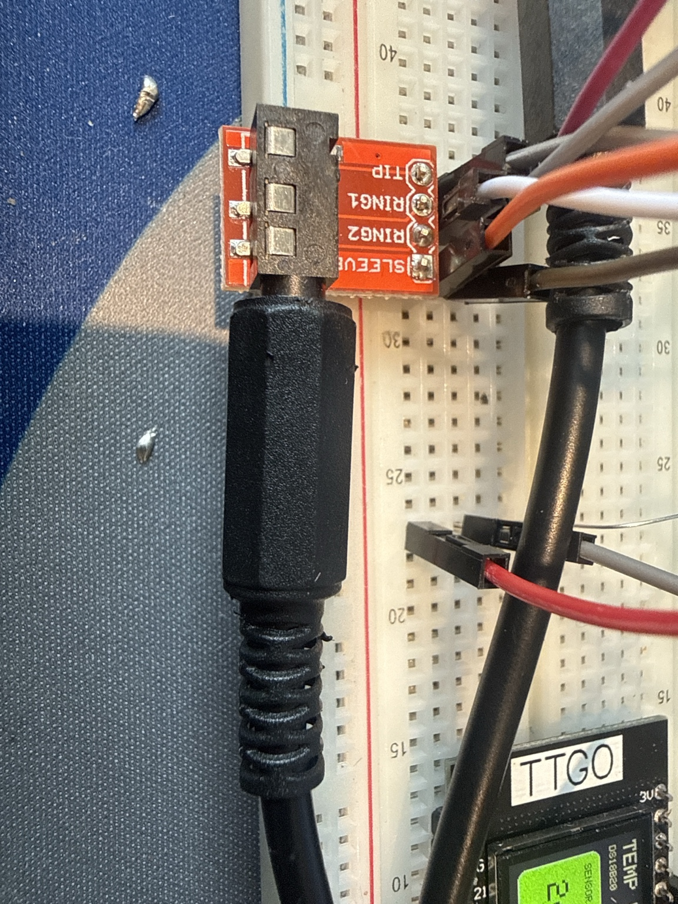

# TTGO Standalone Temperature Logger

A portable standalone temperature logger based on a TTGO ESP32 display module, DS18B20 temperature sensors and microSD card logging.

The logger is designed for offline use in technical rooms, plant rooms, shafts, cabinets and other locations where WiFi or internet access may not be available or reliable.

## Available Versions

This repository contains two Arduino versions:

```text
ttgo-temp-logger-standard.ino
ttgo-temp-logger-powerbank.ino
```

### Standard Version

File:

```text
ttgo-temp-logger-standard.ino
```

Use this version when the logger is powered from a fixed USB power supply or wall adapter.

Features:

- Display stays on
- Logs every 30 seconds
- Simple operation
- Best for permanent or semi-permanent installations with reliable power

### Powerbank Version

File:

```text
ttgo-temp-logger-powerbank.ino
```

Use this version when the logger is powered from a powerbank or used as a portable field unit.

Features:

- WiFi disabled
- Bluetooth disabled
- CPU frequency reduced to 80 MHz
- Display automatically turns off after 60 seconds
- Logger continues measuring and logging while the display is off
- Built-in buttons can wake the display and control logging

Button functions:

```text
GPIO0 short press:
Toggle display on/off

GPIO35 short press:
Force log now

GPIO35 long press:
Pause/resume logging
```

Important: Do not hold the GPIO0 button while powering up or resetting the ESP32. GPIO0 is also used for boot/programming mode on ESP32.

## Function

The unit measures temperature from one or two DS18B20 sensors and stores the values on a microSD card as a CSV file.

The display shows live temperature from each sensor. Each sensor box changes color based on the measured temperature:

- Blue: Below 0 °C
- Green: Normal temperature range
- Yellow/orange: Increasing temperature
- Red: High temperature
- Grey: Sensor missing or read error

## Offline / Standalone Operation

This logger does not depend on WiFi, internet or cloud services.

Time is logged as:

- Seconds since startup
- Days since startup

This makes the logger suitable for portable field use. When starting a measurement, note the actual start time manually. The real timestamp can later be calculated in Excel by adding `dager_siden_start` to the manually recorded start date and time.

Example:

```text
Measurement started: 23.05.2026 14:30
Location: Technical room / heating plant
Sensor 1: Flow pipe
Sensor 2: Room temperature
```

In Excel:

```text
actual_time = start_time + days_since_start
```

## CSV Log Format

Both versions write to:

```text
/templogg.csv
```

The CSV file uses semicolon as separator and comma as decimal separator, making it suitable for Norwegian Excel settings.

CSV columns:

```text
sekunder_siden_start;dager_siden_start;sensor_1_C;sensor_2_C;sensor_antall;logg_OK
```

Example:

```text
sekunder_siden_start;dager_siden_start;sensor_1_C;sensor_2_C;sensor_antall;logg_OK
2;0,000023;24,50;23,25;2;OK
32;0,000370;24,50;23,25;2;OK
62;0,000718;24,75;23,25;2;OK
```

## Powerbank Runtime

Estimated runtime depends on actual current draw, display usage, SD module and powerbank quality. A realistic range is:

```text
10 000 mAh powerbank: approximately 30-60 hours
20 000 mAh powerbank: approximately 60-120 hours
```

Actual runtime should be verified with a USB power meter.

The powerbank version should normally last longer than the standard version because the display turns off automatically and unused radios are disabled.

## Hardware

- TTGO ESP32 with built-in display
- 1-2 DS18B20 temperature sensors
- microSD card module
- microSD card formatted as FAT32
- 4.7 kΩ pull-up resistor for the DS18B20 data line
- Optional jack connectors for removable sensors
- USB power supply or USB powerbank

## Wiring

### DS18B20

Both DS18B20 sensors are connected to the same OneWire data bus.

```text
DS18B20 VDD   -> 3.3V
DS18B20 GND   -> GND
DS18B20 DATA  -> GPIO 27
4.7 kΩ resistor between DATA and 3.3V
```

Suggested jack connector wiring:

```text
TIP    -> DATA
RING   -> 3.3V
SLEEVE -> GND
```

### microSD Module

```text
SD VCC   -> 5V or 3.3V depending on module
SD GND   -> GND
SD CS    -> GPIO 13
SD SCK   -> GPIO 25
SD MOSI  -> GPIO 32
SD MISO  -> GPIO 33
```

Most common microSD modules with onboard regulator are powered from 5V, while signal levels from the ESP32 are 3.3V.

## Arduino Libraries

Install the following libraries in Arduino IDE:

```text
TFT_eSPI
OneWire
DallasTemperature
SD
SPI
FS
WiFi
```

`SPI`, `SD`, `FS` and `WiFi` are normally included with the ESP32 Arduino core.

## Board

Use an ESP32 board profile in Arduino IDE, for example:

```text
ESP32 Dev Module
```

Do not compile as ESP8266.

## Prototype Images

The images below show the prototype setup used during development and testing. For field use, the circuit should be soldered or mounted on a proper prototyping board and installed in an enclosure with strain relief for all external sensor cables.

### Complete prototype setup



### Display during operation



### Sensor jack connector wiring



## Notes

Do not remove the SD card while the logger is powered and writing data. Pause logging and power off the unit before removing the SD card to avoid corrupting the file system.

For long-term use, use a reliable power supply and a good quality FAT32-formatted microSD card.

## Recommended GitHub Structure

```text
ttgo-standalone-temperature-logger/
├── README.md
├── ttgo-temp-logger-standard.ino
├── ttgo-temp-logger-powerbank.ino
├── .gitignore
├── LICENSE
└── images/
    ├── prototype-overview.jpg
    ├── display-working.jpg
    └── jack-connectors.jpg
```

## Changelog

### Powerbank version v1.1.0

- Added display auto-off after 60 seconds
- Added button control
- Added force log function
- Added pause/resume logging function
- Disabled WiFi and Bluetooth
- Reduced CPU frequency to 80 MHz
- Reduced unnecessary SD write checks

### Standard version v1.0.0

- Initial working standard version
- DS18B20 support for one or two sensors
- microSD CSV logging
- Norwegian Excel compatible CSV format
- TTGO display visualization
